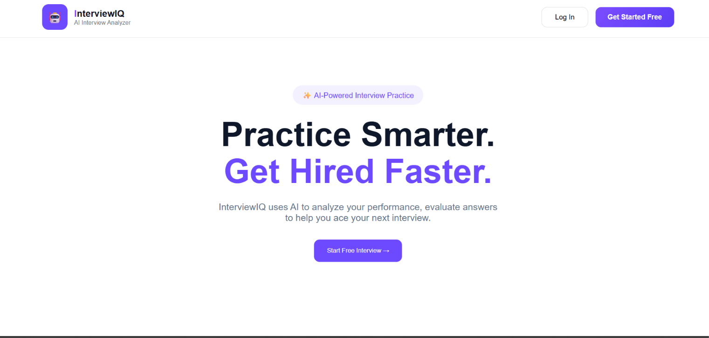

# AI Interview Analyzer - Project Gallery

This gallery showcases the complete workflow of the **AI Interview Analyzer**. The screenshots below demonstrate each stage of the application, from accessing the homepage and logging in to practicing interviews, analyzing resumes, reviewing interview performance, and viewing interview history.

---

# 1. Open the Website

### Image File

```text
screenshots/homepage.png
```

### Description

This is the landing page of the **AI Interview Analyzer**. Users can access the application through their web browser and click **Start Free Interview** or **Log In** to begin their interview preparation.



---

# 2. Login Page

### Image File

```text
screenshots/login page.png
```

### Description

Users enter their registered email address and password to securely access the AI Interview Analyzer. After successful authentication, they are redirected to the dashboard.


---

# 3. AI Interview Dashboard

### Image File

```text
screenshots/dashboard(1).png
```

### Description

The dashboard serves as the central workspace of the application. Users can start a live interview session, enable their webcam and microphone, view interview questions, monitor live transcripts, and receive AI-powered interview tips.

.png)

---

# 4. AI Performance Analysis

### Image File

```text
screenshots/dashboard(2).png
```

### Description

After completing the interview session, the application generates a comprehensive performance report. The dashboard displays the Overall Performance Score, Eye Contact, Confidence, Speech Rate, Filler Words, Response Quality, Speech Clarity, and AI-based Answer Evaluation.

.png)

---

# 5. AI Question Generator

### Image File

```text
screenshots/Ai question generator.png
```

### Description

The AI Question Generator allows users to select an interview domain such as Data Science and automatically generates relevant interview questions for practice.


---

# 6. Resume Match Analyzer

### Image File

```text
screenshots/resume match.png
```

### Description

Users upload their resume and compare it with a job description. The system analyzes resume compatibility, calculates the Resume Match Score, identifies missing skills, and recommends additional skills to improve employability.


---

# 7. Interview History

### Image File

```text
screenshots/interview history.png
```

### Description

The Interview History module stores previous interview sessions, allowing users to review interview scores, dates, and track their improvement over time.


---

The above screenshots demonstrate the complete workflow of the **AI Interview Analyzer**, from accessing the application and logging in to practicing AI-generated interview questions, analyzing interview performance, evaluating resumes, and reviewing interview history. This gallery provides a comprehensive overview of the application's user interface and intelligent interview preparation features.
